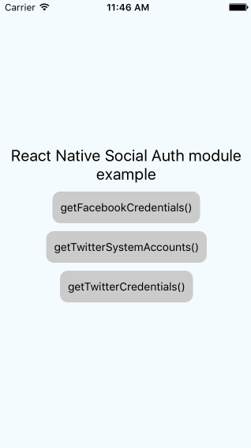

# React Native Social Auth

### React Native module provides auth methods via social networks using native APIs.
#### Very important! The module doesn't provide full stack communication with social networks API, it made just for auth.



## Table of contents
- [What using](#what-using)
- [Installation](#installation)
  - [Common](#common)
  - [iOS](ios)
  - [Android](android)
- [Usage](#usage)
- [Contributing](#contributing)
- [Copyright and license](#copyright-and-license)

## What using
- `facebook`
  - __FacebookSDK__
- `twitter`
	- __Accounts.framework and reverse auth (iOS)__

## Installation

### Common
1. Install package via npm:

```javascript
npm install react-native-social-auth
```

2. Perform platform specific setup
  - [iOS](ios)
  - [Android](android)

3. Inside your code include JS part by adding

  ```javascript
  import SocialAuth from 'react-native-social-auth';
  ```

4. Compile and have fun! Or go to [example](example) and see how it works.

## Usage

#### Constants
  - `SocialAuth.facebookPermissionsType.read`
  - `SocialAuth.facebookPermissionsType.write`


#### getFacebookCredentials(permissions, permissionsType, cb)
  - `permissions` (Array of strings)
  - `permissionsType` (one of [facebookPermissionsType](#constants))
  - `cb(error, credentials)`
    - `error` (object contains `code` and `message`)
    - `credentials` (object contains `accessToken`, `userId`, `hasWritePermissions`)

```javascript

SocialAuth.getFacebookCredentials(["email", "user_friends"], SocialAuth.facebookPermissionsType.read, (error, credentials) => {
  if (error) {
    console.log(error);
  } else {
    console.log(credentials);
  }
});
```

#### getTwitterSystemAccounts(cb)
  - `cb(error, accounts)`
    - `error` (object contains `code` and `message`)
    - `accounts` (array of objects like `{username: "userName"}`)

```javascript
SocialAuth.getTwitterSystemAccounts((error, accounts) => {
  if (error) {
    console.log(error);
  } else {
    console.log(accounts);
  }
});
```

#### getTwitterCredentials(username, [reverseAuthResponse], cb)
  - `username` (Twitter account user name without `@`)
  - `reverseAuthResponse` (is a string that returns by twitter's api when we do the first part of reverse auth)
    - __you can define `key` and `secret` of your twitter app in [RNSocialAuthManager.m](ios/RNSocialAuthManager.m)__
    ```
    #define twitterAppConsumerKey @"..."
    #define twitterAppConsumerSecret @"..."
    ```
    #### But this way is not SAFE!

    - other option is that your backed can perform the first part of reverse auth and send you back response of it.
      It's looks like this
      ```
      OAuth oauth_timestamp="...", oauth_signature="...", oauth_consumer_key="...", oauth_nonce="...", oauth_token="...", oauth_signature_method="HMAC-SHA1", oauth_version="1.0"
      ```
      Then you just pass it to the function as a second parameter

  - `cb(error, credentials)`
    - `error` (object contains `code` and `message`)
    - `credentials` (object contains `oauthToken`, `oauthTokenSecret`, `userName`)

```javascript
SocialAuth.getTwitterCredentials("dimkol", (error, credentials) => {
  if (error) {
    console.log(error);
  } else {
    console.log(credentials);
  }
});
```

## Contributing

Just submit a pull request!

## Copyright and license

Code and documentation copyright 2015 Dmitriy Kolesnikov. Code released under the [MIT license](LICENSE).
